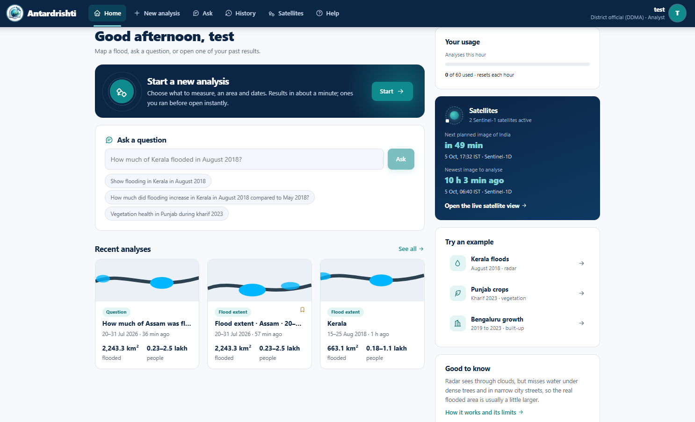
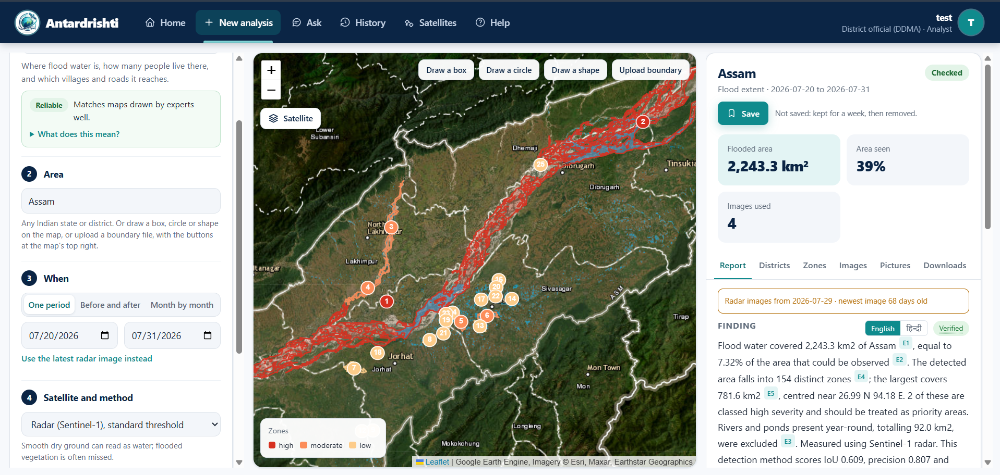
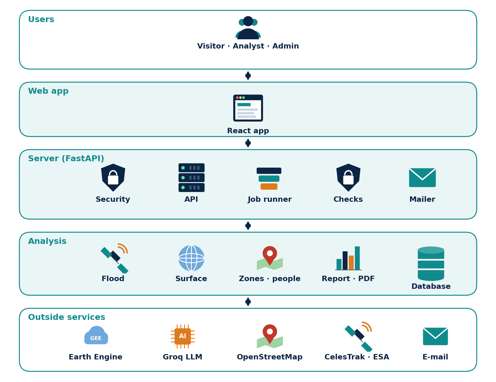

# Antardrishti

**A conversational platform for satellite data analysis.** You ask a question about an Indian region in plain English, such as *"How much of Assam was flooded between 20 and 31 July 2026?"* Antardrishti works out the analysis, the place and the dates. It runs the analysis on Sentinel-1 and Sentinel-2 imagery in Google Earth Engine and returns a map, a short report and the evidence behind every number.

Final-year B.Tech project, Computer Science and Engineering (Artificial Intelligence), Parul University, Vadodara, 2026.



---

## What it does

- **Flood mapping that works under cloud.** It uses Sentinel-1 radar, with a threshold of −18.5 dB on the mean of VV and VH at 200 m. The threshold was chosen by measuring it on the Sen1Floods11 hand-labelled dataset.
- **Answers people can act on.** For each flood it gives:
  - flood area and the share of the region the radar actually saw;
  - people exposed, as a range from two population models (GHSL and WorldPop);
  - affected districts and ranked flood zones;
  - villages and main roads inside each zone, from OpenStreetMap.
- **Plain-language questions.**
  - A language model (gpt-oss-20b via the Groq API) reads the question.
  - Six rule-based checks then compare the reading with the question's own words: dates, days, years and the baseline.
- **Reports that cannot invent numbers.**
  - A larger model (gpt-oss-120b) writes the report.
  - The report is refused if any number in it is not in the evidence record. A fixed template is used instead.
- **More analyses:**
  - before-and-after comparison with a swipe map;
  - month-by-month flood series;
  - the latest radar pass;
  - six Sentinel-2 surface analyses: vegetation, water, built-up, bare ground, green cover and crop stress;
  - a Random Forest land-cover classifier;
  - screening for uploaded images.
- **Outputs:**
  - a report in English or Hindi (the Hindi is checked again after translation);
  - a PDF with pictures;
  - GeoJSON, KML and CSV downloads;
  - a history of saved results.
- **A product, not a demo.**
  - Sign-in with roles (viewer, analyst, admin), e-mail verification and password reset.
  - Background jobs with progress, rate limits, CSRF protection and security headers.
  - SQLite on a laptop, or MongoDB Atlas in deployment.
  - A Satellites page with live Sentinel-1 positions and the next planned images of India.



## Measured accuracy

Every method was scored against labelled data before it shipped. The numbers below are shown inside the app next to each result.

| Method | Data | IoU | Precision | Recall |
|---|---|---|---|---|
| Flood, Sentinel-1, mean(VV,VH) < −18.5 dB at 200 m | Sen1Floods11 test split (88 chips) | 0.609 | 0.807 | 0.713 |
| Same rule, Indian chips never used for tuning | Sen1Floods11 India, Assam 2016 (28 chips) | 0.725 (95% range 0.564–0.829) | 0.902 | 0.787 |
| Vegetation health, NDVI > 0.2 | ESA WorldCover 2021, six areas | 0.888 | 0.949 | 0.932 |
| Bare ground, BSI > 0.15 | ESA WorldCover 2021 | 0.747 | 0.804 | 0.914 |
| Built-up, Random Forest | Held-out districts (Jaisalmer, Bangalore Urban) | 0.434 | 0.754 | 0.505 |

Question understanding was scored on our own India EO Query Benchmark. On 20 held-out questions written in new phrasings, every field was right for 11 of the 20 (0.55), and the analysis type was right for 0.80. The question checks exist because of this gap.

Ideas that were measured and **not** shipped:
- Otsu thresholding.
- Region growing.
- A HAND terrain mask. It raised test IoU slightly but cut recall on the Indian chips beyond the limit we had set before the run.

The notebooks in `backend/notebooks/` contain every measurement.

## Architecture



| Part | Technology |
|---|---|
| Web app | React 19, Vite, Leaflet, three.js, satellite.js |
| API and jobs | Python, FastAPI, Uvicorn |
| Satellite processing | Google Earth Engine (Sentinel-1 GRD, Sentinel-2 SR, JRC Global Surface Water, GHSL, WorldPop, FAO GAUL, ESA WorldCover) |
| Language models | Groq API: gpt-oss-20b (routing), gpt-oss-120b (reports, Hindi) |
| Machine learning | scikit-learn Random Forest, serialised to run inside Earth Engine |
| Database | SQLite locally, MongoDB Atlas in deployment |
| Exports | reportlab and uharfbuzz (PDF with Hindi), GeoJSON, KML, CSV |
| Deployment | Docker; AWS EC2 (Mumbai) with MongoDB Atlas |

## Project layout

```
antardrishti/
  backend/
    main.py           FastAPI app, the only entry point
    core/             settings, auth, jobs, cache, evidence record, verification, question checks
    geo/              regions (FAO GAUL), uploaded boundaries, zones, population, villages and roads
    detection/        Sentinel-1 flood, Sentinel-2 surface analyses, classifier, image upload
    pipeline/         routing, analysis, report writing, Hindi, PDF and GIS export, monthly series
    orbits/           satellite positions and ESA acquisition plans
    notebooks/        accuracy measurements (01-09) and report figures (10)
    scripts/          training, diagnosis, user management, test runners
    tests/            pytest suite (unit and integration)
  frontend/           React web app (src/components, src/lib with Node unit tests)
  evaluation/         measurement code and result files (JSON)
  models/             Random Forest metadata (the .pkl is rebuilt, not committed)
  contracts/          API response contract
  Dockerfile, docker-compose.yml, start.ps1, DEPLOYMENT.md
```

`backend/README.md` explains the backend modules in more detail.

## Getting started

### What you need

- Python 3.10 or newer, and Node.js 20 or newer (needed by Vite 8)
- A Google Earth Engine account with a Cloud project registered for Earth Engine
- A Groq API key

### 1. Configure

```bash
cd backend
python -m venv venv
venv\Scripts\pip install -r requirements.txt     # Windows
# source venv/bin/activate && pip install -r requirements.txt   # Linux / macOS

copy .env.example .env                           # then fill in the values
earthengine authenticate                         # once, on a laptop
```

The minimum settings in `backend/.env` are `EE_PROJECT_ID`, `GROQ_API_KEY` and `SECRET_KEY`. To create the first admin, set `ADMIN_USERNAME` and `ADMIN_PASSWORD`, or run `python -m scripts.manage_users create <name> --role admin`. `MONGODB_URI` switches storage from SQLite to MongoDB Atlas. All the settings are listed in `.env.example`.

> **Never commit `backend/.env`, API keys or Earth Engine credentials.** They are in `.gitignore`.

### 2. Run

**Windows, one command.** This builds the web app if needed and serves everything at http://127.0.0.1:8000:

```powershell
.\start.ps1
```

**Docker:**

```bash
docker compose up --build        # http://localhost:8000
```

**Development, with hot reload:**

```bash
cd backend && uvicorn main:app --reload           # API on :8000
cd frontend && npm install && npm run dev         # web app on :5173
```

`DEPLOYMENT.md` covers servers, the Earth Engine service account, MongoDB Atlas and health checks.

## Tests

```bash
cd backend
python -m scripts.run_tests       # unit + integration (pytest) and frontend (Node); writes a summary
python -m scripts.system_test     # 25 end-to-end cases against a running server
pytest -m earthengine             # slow tests that use real Earth Engine quota
```

| Level | Tests | Result |
|---|---|---|
| Backend unit (pytest) | 482 | all passed |
| Backend integration (pytest) | 582 | 581 passed, 1 skipped by design |
| Frontend unit (Node test runner) | 242 | all passed |
| System tests (HTTP, running server) | 25 | all passed |

The default test run needs no credentials, no network and no Earth Engine quota. Earth Engine is replaced by a stand-in that builds flood scenes from NumPy grids.

## Limitations

- At 200 m the flood rule finds about 71% of labelled water. Water under crops and trees and floods between buildings are mostly missed.
- The Indian validation is one event (Assam, 2016). Other Indian landscapes are untested.
- The two population models can disagree widely, so people are reported as a range.
- FAO GAUL 2015 lacks districts created after 2015. GAUL 2025 is used as a fallback.
- The free Earth Engine tier has a monthly compute quota. The district-level evaluation of green cover and crop stress is written (`evaluation/green_cover.py`, `evaluation/crop_stress.py`) but has not been run yet.

## Team

| Name | Enrolment No. |
|---|---|
| Punith KM | 2303031241080 |
| Krishna Omkar Chaurasiya | 2303031241654 |
| Praful Kumar | 2303031241054 |
| Raunak Kumar Kunwar | 2303031241130 |

**Guide:** Prof. Nilesh Khodifad, Assistant Professor, Parul University, Vadodara

## Acknowledgements

This project is built on open data and tools:
- the Copernicus Sentinel-1 and Sentinel-2 missions (ESA)
- Google Earth Engine
- Sen1Floods11 (Bonafilia et al., 2020)
- ESA WorldCover
- JRC Global Surface Water and GHSL
- WorldPop
- FAO GAUL
- OpenStreetMap contributors (ODbL)
- CelesTrak
